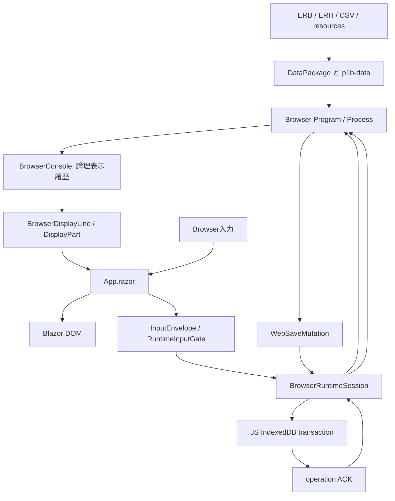

# Web版アーキテクチャ

## 全体

同期実行を前提とする既存Emuera `Process` と、非同期のブラウザ入力・保存をつなぐ役割は `BrowserRuntimeSession` が担います。画面操作やIndexedDBの完了を待つ間はProcessを進めず、入力結果または保存ACKを境界として再開します。

## 主な部品

- `BrowserRuntimeSession`: Processの開始・入力・タイトル復帰・保存待ち・ACKを管理する。
- `BrowserConsole`: Windows Consoleに対応する論理表示状態、入力要求、履歴を持つ。DOMを履歴の正本にしない。
- `BrowserDisplayLine` / `BrowserDisplayPart`: 行、style、HTML、画像、現在世代の入力Activationを表す。
- `BrowserDisplayWindowState` と `display-window.js`: 論理履歴を保持したままDOMへ可視範囲をsliceし、spacerとscroll anchorを管理する。
- `BrowserImages`: Skiaで作るWeb画像、Sprite、文字描画、キャッシュ世代、所有権を管理する。
- `BrowserHtmlParser`: Emueraが出力する対応HTMLをWeb表示モデルへ変換する。
- `DataPackage`: manifestを検証し、packを隔離stageへ展開する。
- `App.razor`: DOM、ユーザーイベント、JavaScript bridgeとRuntime状態を接続する。
- `wwwroot/*.js`: package取得、入力補助、IndexedDB、保存管理などのブラウザAPIを担当する。

## 入力

ブラウザイベントは `App.razor` で現在のsession/requestを含む `InputEnvelope` に変換され、`RuntimeInputGate` と `BrowserRuntimeSession` を通ります。遅れて届いたイベントや重複イベントはsession generation、request ID、display/button generationで拒否します。

## 保存

SAVE/SAVEGLOBALのmutationはProcessのqueueからsessionへ渡されます。JavaScriptがWeb Lockを取得し、IndexedDB transactionとrevision比較を完了した後、同じoperation IDのACKを返します。ACKを受ける前にProcessを再開しません。詳しくは[保存仕様](05_保存・IndexedDB仕様.md)を参照してください。
